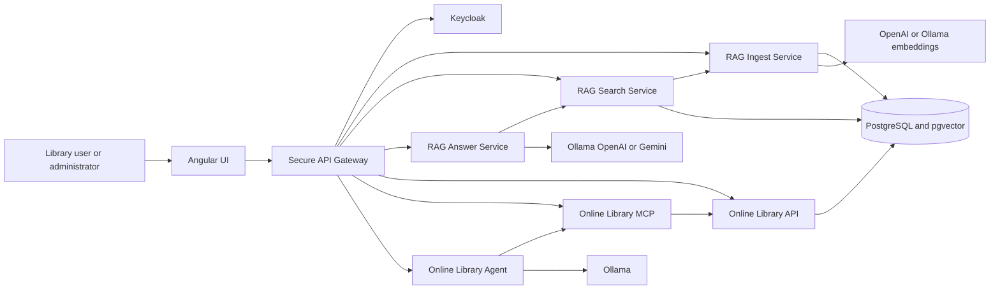
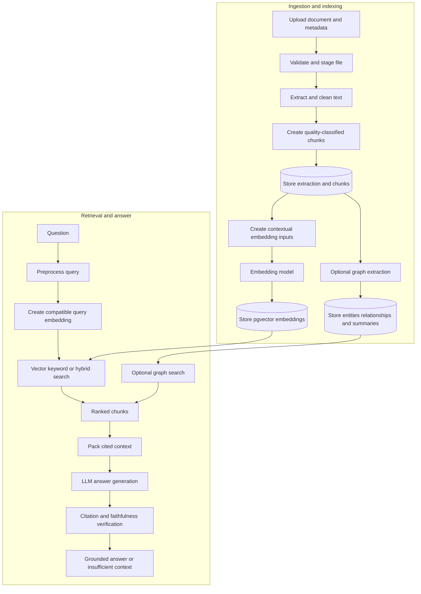
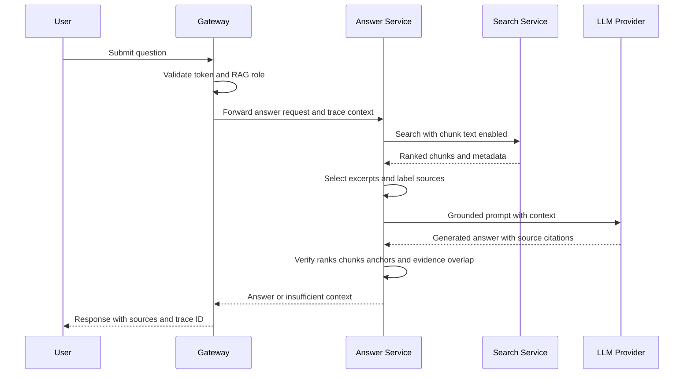
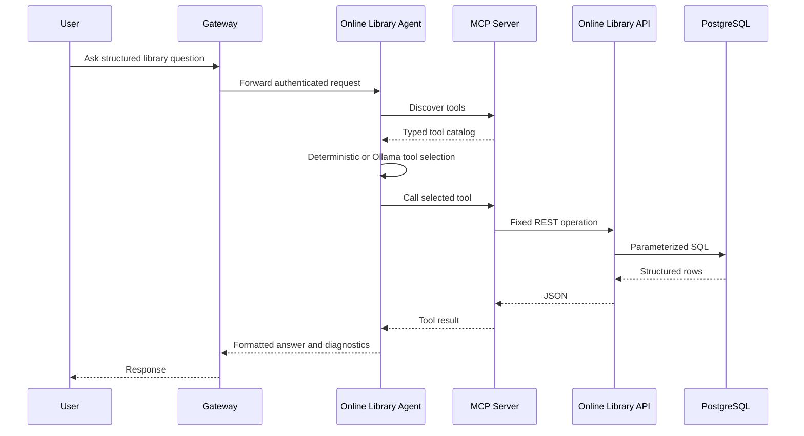
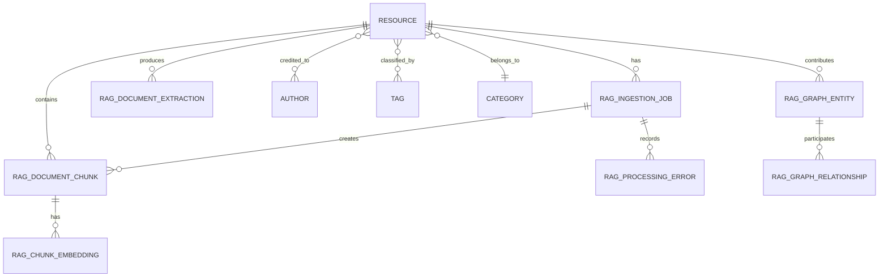

# My Agent POC Master Service Architecture

## Document purpose

This document describes the current service architecture of My Agent POC, including module responsibilities, interfaces, dependencies, data ownership, security boundaries, and the main data and control flows. The system is a modular proof of concept for authenticated library discovery, document ingestion, Retrieval Augmented Generation, structured library tools, and agent demonstrations.

The central architecture separates document preparation from retrieval and answer generation. The Ingest Service creates cleaned chunks and vector or graph indexes. The Search Service uses those indexes to return ranked evidence. The Answer Service supplies that evidence to an LLM and verifies the generated citations before returning an answer.

## System context

The Angular UI normally communicates only with the gateway. The gateway authenticates the request, checks roles, and forwards it to the responsible service. Internal services share trace context but retain separate responsibilities and APIs.

## Service inventory

| Module | Runtime role | Default port | Primary dependencies |
| --- | --- | ---: | --- |
| `angular-ui` | Single-page browser client | 80 in container | Secure API Gateway |
| `secure_api` | Authentication, authorization, routing, and policy enforcement | 8010 | Keycloak and all downstream services |
| `rag-ingest-service` | Document extraction, cleanup, chunking, vector creation, and graph indexing | 8000 | PostgreSQL, pgvector, embedding provider |
| `rag-search-service` | Keyword, vector, hybrid, graph, and combined retrieval | 8001 | PostgreSQL, pgvector, embedding provider, Ingest Service admin API |
| `rag-answer-service` | Grounded answer generation, verification, and model comparison | 8002 | Search Service and LLM provider |
| `online_library` | Structured catalog and account query API | 8003 | PostgreSQL |
| `online_library_mcp` | MCP tools over the Online Library API | 8004 | Online Library API |
| `online_library_agent` | Natural-language tool selection and structured answers | 8005 | MCP server and Ollama |
| `weather_agent` | Deterministic current-weather demonstration | Configurable | weather.com and wttr.in |
| `weather_ai_agent` | LLM summary over deterministic weather observations | Configurable | Weather Agent, weather sources, Gemini or Ollama |

## Architectural principles

- The gateway is the browser-facing policy enforcement point.
- Ingestion, retrieval, and answer generation are separate services with explicit APIs.
- PostgreSQL is the system of record; pgvector extends it for vector similarity.
- Stored chunk vectors and query vectors use the same embedding contract.
- Generated answers are returned only after citation and evidence checks.
- The structured library path uses typed SQL-backed APIs and MCP tools rather than vector search.
- Trace and request identifiers cross service boundaries.
- Long-running ingestion is represented by persistent jobs rather than a single open upload request.

## Main RAG lifecycle

## Document ingestion and indexing

### Request and job creation

An authorized administrator submits a TXT, PDF, DOCX, or EPUB file with catalog metadata, chunk settings, and an indexing mode. The gateway enforces an ingest or administrator role and forwards the multipart request to the Ingest Service.

The Ingest Service validates the extension, file size, metadata, chunk size, overlap, and indexing mode. It stores the original in staged file storage, calculates hashes, extracts embedded metadata, and merges it with submitted metadata. Explicit request metadata takes precedence. The service persists the resource, author, category, and tag relationships and creates an ingestion job before dispatching background work.

### Extraction and cleanup

The worker selects a parser for the file type. PDF parsing can use PyMuPDF or pypdf. DOCX paragraphs and tables are extracted through python-docx. EPUB processing follows the package spine and converts HTML content to text. TXT content is decoded directly.

PDF cleanup removes repeated page headers and footers, standalone page numbers, configured boilerplate, excessive blank lines, and selected joined-word artifacts. Page markers are retained so chunks can record page ranges for later citations. The extraction record stores parser name, page count, character and token counts, content hash, full text, and extraction metadata.

### Chunking and quality controls

Semantic-recursive and intelligent-recursive strategies split text while respecting paragraphs, sections, headings, token budgets, and configured overlap. Each chunk records its index, text, hash, token and character counts, page range, section, heading path, type, and extensible metadata.

Quality filters normalize text, merge undersized neighboring chunks when safe, classify front matter and boilerplate, detect table-of-contents and numeric-table-heavy content, and mark weak chunks as non-searchable. Persisting the classification allows search to exclude poor evidence without losing diagnostic history.

### Vector creation

For `STANDARD` or `BOTH` indexing, the worker creates an embedding input that combines resource context with cleaned chunk text. The provider factory selects OpenAI or Ollama. The model registry validates the model and vector dimension. Vectors are created in batches with retry and backoff, validated, and stored with provider, model, version, and dimension metadata.

The worker checks for existing vectors before each batch. This lets retry and reindex jobs resume without recreating completed work. Search must use the same embedding provider, model, version, and dimension to create query vectors.

### Graph indexing

For `GRAPH` or `BOTH`, Graph RAG services extract entities and relationships from chunks, group graph entities into communities, and create summaries. Graph records point back to source resources and chunks. Runtime Graph RAG settings are stored in the database and exposed through controlled administrative endpoints.

### Completion and recovery

Job progress, counts, heartbeats, errors, and profiling events are persisted. Successful processing marks the resource `READY` and the job `COMPLETED`; the staged original can be deleted according to configuration. Failures record the processing stage and exception details. Recovery logic detects stale processing jobs, and retry operations can reuse extractions, chunks, and compatible vectors.

## Search and retrieval

### Standard search modes

The Search Service accepts `vector`, `keyword`, or `hybrid` mode. Requests can filter by resource, category, tags, and metadata. Query preprocessing normalizes text, expands configured aliases, and classifies query intent.

Vector search creates a query vector and performs similarity search over compatible stored chunk embeddings. Keyword search uses PostgreSQL lexical matching. Hybrid search oversamples both candidate sets, normalizes component scores, applies reciprocal-rank fusion, and reranks the merged candidates. Oversampling gives fusion enough candidates before the final `top_k` limit is applied.

Result-quality logic removes non-searchable chunks and suppresses weak boilerplate or front-matter matches. Snippet building selects query-focused excerpts. Results contain rank, score, resource and chunk identifiers, title, page range, section, snippet, and optional chunk text and metadata.

### Graph and combined search

Graph search uses stored entities, relationships, communities, and summaries. Combined search returns standard chunk results and graph evidence together. Standard chunks remain the main evidence passed to the Answer Service because they preserve source text and citation locations.

### Administrative search functions

The Search Service also presents a consolidated resource view with ingestion state, chunk counts, vector counts, graph state, and recent job information. Retry, reindex, delete, and Graph RAG settings operations are forwarded to the Ingest Service so ingestion logic has one owner.

## Grounded answer generation

The Answer Service does not read the database. It requests ranked evidence from Search, packs a bounded amount of source text, and labels each source with rank, title, chunk, page, and section. Prompt instructions require the model to rely only on those blocks and cite source ranks.

The provider factory supports Ollama, OpenAI, and Gemini. After generation, the faithfulness verifier checks that citations exist, cited ranks were supplied, cited chunk numbers match, named question anchors occur in the evidence, unsupported inference phrases are absent, and answer terms sufficiently overlap retrieved context. Failed verification produces a deterministic `insufficient_context` response rather than exposing an unverified answer.

Model comparison reuses one search and context package for every model. The streaming endpoint emits search completion, model-started, model-result, and final events so the Angular UI can update progressively.

## Structured library and MCP flow

The Online Library API provides structured catalog and account queries. It uses parameterized Psycopg SQL and an allowlist for diagnostic tables. The MCP server turns fixed API operations into typed tools. The Online Library Agent discovers those tools and uses deterministic rules or Ollama to choose a tool and construct arguments. This path is appropriate for structured facts such as authors, genres, users, subscriptions, and approvals; it is separate from document-content RAG.

## Browser application and gateway

The Angular UI organizes features into lazy-loaded routes and typed API services. Authentication, role, correlation, and error interceptors keep cross-cutting behavior out of feature components. Route guards hide protected screens, while the gateway performs the authoritative role check.

The gateway validates Keycloak tokens with cached JWKS data, combines realm and client roles, and applies route dependencies. It forwards trusted internal API keys, user identity, roles, request IDs, and W3C trace context. JSON, multipart, and Server-Sent Events each have an appropriate proxy path.

## Data architecture

PostgreSQL is the durable store for catalog data and RAG processing state. pgvector stores embedding columns and supports nearest-neighbor search. The model separates job history, extracted text, chunks, and embeddings so each stage can be inspected and resumed.

Important stored data includes resources and descriptive metadata; authors, categories, and tags; ingestion jobs and errors; full extractions; chunks and page metadata; embedding vectors and model identity; profiling events; graph entities, relationships, communities, and summaries; and structured library users, subscriptions, approvals, and reading data.

## Security architecture

Keycloak is the identity provider, and the gateway is the policy enforcement point. Browser requests carry a bearer access token. The gateway verifies the token and checks one or more roles before proxying the request.

| Role | Typical capability |
| --- | --- |
| `rag_search_user` | Standard and graph content search where configured |
| `rag_user` | Grounded answers and model comparison |
| `rag_ingest_user` | Document upload and job monitoring |
| `graph_rag_user` | Graph-specific operations where configured |
| `rag_admin` | Resource administration, ingestion, settings, and broad RAG access |
| `system_admin` | System-level administrative operations |

Downstream services should be private and accept user-context headers only from the gateway. Provider keys, database passwords, Keycloak secrets, and internal API keys belong in secret storage. Debug endpoints, raw prompts, direct development UIs, and diagnostic table tools require additional protection outside local development.

## Observability and failure behavior

Every major service accepts or creates request and trace identifiers. The gateway returns those identifiers to the client and forwards them downstream. Ingestion adds persistent stage and timing records. Search can report preprocessing, candidate, score, and timing diagnostics. Answer can report retrieval, context, generation, and verification timings.

The architecture uses explicit failure boundaries:

- Upload validation fails before a resource job is dispatched.
- Ingestion persists stage-specific errors and can resume from stored checkpoints.
- Search dependency or provider errors do not become fabricated empty results.
- Answer rejects missing context and unverified generation.
- Model comparison isolates a single model failure from other models.
- The library agent preserves successful structured results when optional LLM summarization fails.
- Health and readiness endpoints distinguish process availability from required dependency readiness.

## Deployment architecture

Kubernetes manifests exist for the Angular UI, Secure API Gateway, RAG Ingest, RAG Search, RAG Answer, Online Library API, Online Library MCP, Online Library Agent, and weather demonstrations. ConfigMaps hold non-secret service addresses and behavior flags. Secrets should hold credentials and provider keys.

Recommended network policy permits browser traffic only to the UI and gateway, gateway traffic to downstream services, Answer-to-Search traffic, Search-to-Ingest administrative traffic, MCP-to-Library traffic, Agent-to-MCP traffic, and the minimum required database and model-provider connections. PostgreSQL, Keycloak, Ollama, and internal services should not be directly exposed to untrusted networks.

## Module documentation index

- `modules/angular-ui/docs/ARCHITECTURE_CURRENT.md`
- `modules/secure_api/docs/ARCHITECTURE.md`
- `modules/rag-ingest-service/docs/ARCHITECTURE.md`
- `modules/rag-search-service/docs/ARCHITECTURE.md`
- `modules/rag-answer-service/docs/ARCHITECTURE.md`
- `modules/online_library/docs/ARCHITECTURE.md`
- `modules/online_library_mcp/docs/ARCHITECTURE.md`
- `modules/online_library_agent/docs/ARCHITECTURE.md`
- `modules/weather_agent/docs/ARCHITECTURE.md`
- `modules/weather_ai_agent/docs/ARCHITECTURE.md`

## Operational risks and recommended hardening

- Treat embedding settings as a versioned contract and require reindexing when they change.
- Protect direct service UIs and debug routes or disable them outside development.
- Move all credentials from plain configuration to managed secrets and rotate them.
- Apply database least privilege separately for ingest, search, and structured read APIs.
- Add distributed-tracing export and metrics dashboards around the existing trace context and timings.
- Define backup, restore, vector reindex, and graph reindex procedures.
- Add network policies, TLS, restrictive CORS, and ingress request-size limits.
- Review browser token storage and Content Security Policy before production use.
- Keep ingestion schemas and Search Service query assumptions under migration tests.
- Add an integration test that ingests one fixture, searches for it, and verifies a cited answer through the gateway.

