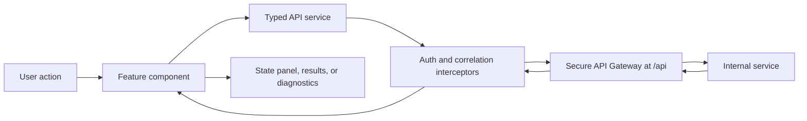

# Angular UI Architecture

## Purpose and boundary

The Angular UI is the primary single-page browser client for the secure library and RAG platform. It presents authentication, catalog, search, answer, model comparison, ingestion, and administration workflows. It calls only the Secure API Gateway through the `/api` path and never connects directly to PostgreSQL, Keycloak administration APIs, embedding providers, or internal microservices.

The production container serves compiled static files through Nginx. Local development uses Angular tooling and a proxy configuration that maps `/api` to the gateway.

## Route structure

| Route | Capability | Access |
| --- | --- | --- |
| `/login` and `/register` | Authentication and registration | Public |
| `/books` | Resource overview and state | Authenticated |
| `/catalog` | Structured catalog discovery and detail | Authenticated |
| `/search` | Vector, keyword, hybrid, graph, or combined retrieval | Search roles |
| `/answer` | Grounded question answering | RAG user or administrator |
| `/compare` | Multi-model answer comparison with streaming | RAG user or administrator |
| `/library-search` | Natural-language structured library questions | Authenticated |
| `/ingest` | Document upload and job monitoring | Ingest role or administrator |
| `/admin/resources` | Retry, reindex, delete, and Graph RAG settings | Administrator |
| `/admin/library-tools` | MCP tool discovery and calls | Administrator |

## Internal structure

| Layer | Responsibility |
| --- | --- |
| Feature components | Own each screen's form state, loading state, validation, response presentation, and user actions. |
| Core API services | Provide typed methods for gateway route groups, including auth, catalog, search, answer, ingest, resource administration, library agent, tools, and health. |
| Authentication service | Stores tokens, loads the current user, refreshes access tokens, logs out, and exposes authentication state. |
| Interceptors | Add bearer tokens and correlation headers, retry after eligible authentication failures, and normalize HTTP errors. |
| Route guards | Prevent unauthenticated navigation and hide role-restricted screens. |
| Shared components and pipes | Render search results, diagnostics, JSON, status badges, confirmations, and byte counts consistently. |
| Environment adapter | Builds gateway URLs and isolates deploy-time base-path configuration. |

## Browser request flow

## Authentication lifecycle

1. Login sends credentials to `/api/auth/login` without an existing bearer token.
2. The authentication service stores the access and refresh tokens and loads `/api/auth/me`.
3. `authGuard` blocks protected routes when no authenticated user is available.
4. `roleGuard` compares route metadata with the current user's roles.
5. The auth interceptor attaches the access token to ordinary API calls.
6. When an eligible request returns an authentication failure, the service performs one shared refresh request, stores the replacement tokens, and retries the original call.
7. Logout calls the gateway when a refresh token exists and then clears local state.

Gateway authorization remains authoritative. Guards are a user-experience layer and cannot secure an API by themselves.

## Feature data flows

Search submits a typed search request and renders ranked chunks, scores, snippets, pages, and metadata. Answer submits a question and renders answer status, citations, source cards, and optional diagnostics. Compare uses `fetch` to consume Server-Sent Events from the authenticated gateway endpoint and updates model cards as results arrive.

Ingest builds a multipart form with the document, catalog metadata, chunk settings, and indexing mode. After a `202 Accepted` response, it polls the job endpoint and displays progress and persisted errors. Resource administration calls gateway endpoints for retry, standard or graph indexing, deletion, and Graph RAG settings.

## State and error handling

The application uses Angular services and component-local signals or state rather than a global state library. API models are centralized in `core/models/api.models.ts`. The error interceptor converts `HttpErrorResponse` data into a stable application error shape, while reusable state and diagnostics components present loading, empty, error, and success states.

## Security considerations

- The UI calls the gateway only; Nginx and the development proxy keep internal service addresses out of browser code.
- Role-based navigation does not replace server-side authorization.
- Tokens are stored in browser storage by the current POC. A production design should review XSS defenses, Content Security Policy, token lifetime, and alternatives such as secure same-site cookies.
- Arbitrary HTML from service responses must not be inserted into the DOM without sanitization.
- Server-Sent Events use an authenticated `fetch` stream because the native `EventSource` API cannot set the required bearer header.

## Deployment

The Docker build compiles the Angular application and serves it with Nginx. `k8s/angular-ui` contains its deployment and service. The gateway base path is `/api`; ingress or reverse-proxy configuration must route that path to the Secure API Gateway and all remaining paths to the UI.

## Key source files

- `src/app/app.routes.ts`
- `src/app/app.config.ts`
- `src/app/core/auth/auth.service.ts`
- `src/app/core/interceptors/auth.interceptor.ts`
- `src/app/core/interceptors/correlation.interceptor.ts`
- `src/app/core/interceptors/error.interceptor.ts`
- `src/app/core/services`
- `src/app/core/models/api.models.ts`
- `src/app/features`
- `nginx.conf`
- `proxy.conf.json`

