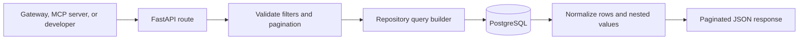

# Online Library API Architecture

## Purpose and boundary

The Online Library API provides read-only structured access to catalog, author, user, subscription, approval, and selected diagnostic table data stored in PostgreSQL. It is the structured-data counterpart to RAG content search. It does not generate embeddings, perform semantic retrieval, or use an LLM.

The service normally runs on port 8003 and exposes FastAPI OpenAPI documentation at `/docs`.

## External interfaces

| Route group | Purpose |
| --- | --- |
| `/catalog/resources` and `/catalog/resources/{id}` | Search and retrieve catalog resources with authors, tags, category, and publication metadata. |
| `/catalog/books/by-author`, `/by-genre`, and `/by-tag` | Convenience catalog searches. |
| `/catalog/authors` and `/catalog/facets` | Author discovery and filter values. |
| `/users/search` | Search structured library-user records. |
| `/subscriptions/search` | Search user subscriptions and tier information. |
| `/approvals/search` | Search user approval requests. |
| `/tables` and named table routes | List and page through an allowlisted set of diagnostic tables. |
| `/health/db` | Verify database connectivity. |

## Internal components

The API layer validates query parameters, maps convenience routes to repository operations, and produces stable JSON response shapes. The repository layer uses Psycopg 3 with dictionary rows and parameterized SQL. The database configuration layer constructs connection details from environment variables. Trace middleware accepts or creates W3C trace context and request identifiers.

## Catalog query flow

## Query behavior

Catalog search supports free text, author, category or genre, tag, publisher, language, access tier, resource status, publication-date range, sorting, limit, and offset. Repository queries join resource metadata with authors and tags and return normalized arrays. Optional resource columns are detected so the service can tolerate supported schema variants.

Business searches expose named filters for users, subscriptions, and approvals. Diagnostic table access uses a fixed allowlist and safe SQL identifier handling; callers cannot supply an arbitrary table name.

## Data ownership and relationships

The service reads the same catalog resource records that the Ingest Service creates or enriches. Core relationships include resources to categories, many-to-many resource authors, many-to-many resource tags, users to subscriptions, and users to approval requests. Large binary document fields are excluded from catalog responses.

This module is the direct database owner for structured query behavior, while the MCP module and natural-language agent remain adapters above it.

## Failure handling and observability

- Database connection and query errors are logged and returned as API failures without exposing credentials.
- Pagination bounds limit response size.
- Unknown diagnostic tables are rejected before SQL execution.
- Trace IDs, span IDs, parent span IDs, and request IDs are propagated in logs and response headers.
- `/health/db` separates database readiness from process availability.

## Security and deployment

The intended user-facing path is through the Secure API Gateway. Direct access should be limited to trusted internal services, especially because diagnostic routes expose raw structured records. Database credentials belong in secret storage, and the database account should have only the permissions required by this read-only service.

Kubernetes manifests are under `k8s/online-library`. The service depends only on PostgreSQL at runtime.

## Key source files

- `api.py`
- `repository.py`
- `db.py`
- `config.py`
- `trace_context.py`
- `sql/schema.sql`

