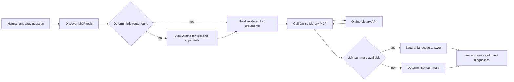

# Online Library Agent Architecture

## Purpose and boundary

The Online Library Agent answers natural-language questions about structured library data. It discovers MCP tools, selects an appropriate tool, extracts arguments, invokes that tool, and formats the structured result. It does not query PostgreSQL directly and is separate from RAG document-content question answering.

The service normally runs on port 8005. It exposes a JSON and form-based `/ask` interface, `/tools` for discovery diagnostics, and `/health`.

## Internal components

| Component | Responsibility |
| --- | --- |
| `OnlineLibraryPlanner` | Coordinates discovery, deterministic routing, LLM tool choice, argument validation, tool execution, and answer formatting. |
| `OnlineLibraryMCPClient` | Lists tools and calls the selected MCP tool over Streamable HTTP. |
| `OllamaClient` | Requests low-temperature JSON tool choices and optional natural-language summaries from a local model. |
| Deterministic routing helpers | Recognize common catalog, author, genre, tag, user, subscription, approval, and identifier patterns without relying entirely on model output. |
| FastAPI UI and API | Accept browser forms or JSON questions and render result tables and diagnostics. |

## Question flow

## Control flow

1. The request validates the question, pagination, and optional diagnostic controls.
2. The planner asks the MCP server for the current tool catalog rather than relying on a hard-coded list alone.
3. Deterministic rules handle common questions and extract predictable filters such as author, genre, tag, status, tier, or resource UUID.
4. When rules do not resolve the request, Ollama receives the question and compact tool schemas and must return a JSON tool choice.
5. The planner rejects unknown tools, clamps pagination, and normalizes arguments before execution.
6. The MCP result is summarized by the model when possible. A deterministic formatter remains available when model selection or summarization fails.
7. The response includes the answer, selected tool, arguments, raw tool result, model, fallback status, configuration, and timings.

## Separation from RAG Answer

This agent answers questions from structured catalog and account tables, such as books by an author or subscriptions with a given status. The RAG Answer Service answers questions about the contents of ingested documents by retrieving chunks and citing them. A user-facing application may offer both, but their evidence sources and trust controls differ.

## Failure handling and observability

- MCP discovery failures prevent tool selection and are reported as dependency failures.
- Invalid model JSON, unknown tools, and incomplete arguments fall back to deterministic routing when possible.
- Summary-generation failures preserve the successful tool result and use a deterministic summary.
- Timings distinguish discovery, planning, tool execution, summarization, and total latency.
- Trace context propagates through the agent to MCP and then to the Online Library API.

## Security and deployment

The Secure API Gateway is the intended public entry point. Tool access should be restricted according to the data returned; account and diagnostic questions may require stronger roles than catalog discovery. Ollama prompts can contain user questions and structured query results, so the model endpoint must be treated as part of the trusted processing boundary.

Kubernetes manifests are under `k8s/online-library-agent`. Runtime dependencies are the Online Library MCP server and Ollama.

## Key source files

- `api.py`
- `planner.py`
- `mcp_client.py`
- `llm.py`
- `models.py`
- `config.py`
- `trace_context.py`

