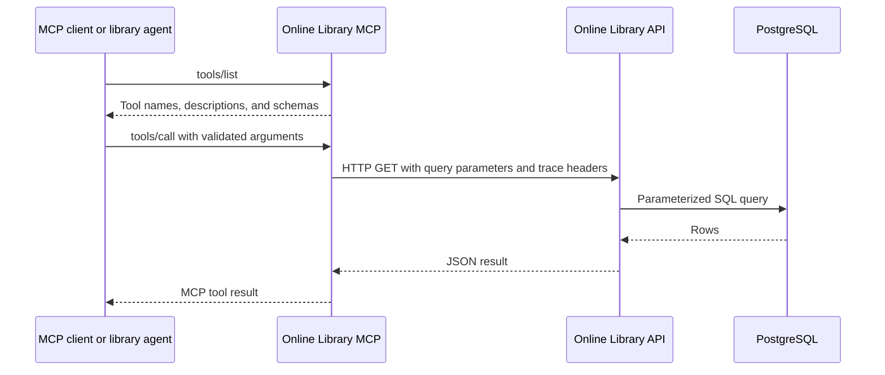

# Online Library MCP Architecture

## Purpose and boundary

The Online Library MCP module exposes structured Online Library API operations as discoverable Model Context Protocol tools. It is a protocol adapter: it owns tool names, descriptions, schemas, and REST-to-MCP response handling, but it does not access PostgreSQL directly and does not choose tools for a user question.

The server normally runs on port 8004 and exposes stateless Streamable HTTP at `/mcp`.

## External interface

MCP clients use protocol operations such as tool discovery and tool invocation. The registered tools cover:

- Catalog resource search and detail.
- Books by author, genre, or tag.
- Catalog author search and available facets.
- User, subscription, and approval-request searches.
- Subscription rules and tiers.
- Allowlisted table retrieval for administrative diagnostics.

## Internal components

| Component | Responsibility |
| --- | --- |
| `server.py` | Creates FastMCP, installs tracing, registers tools, and starts Streamable HTTP. |
| `tools.py` | Defines typed tool functions, descriptions, defaults, and argument schemas. |
| `OnlineLibraryAPIClient` | Sends asynchronous REST requests to the Online Library API. |
| `config.py` | Loads the API base URL, host, port, and request timeout. |
| `trace_context.py` | Forwards trace and request identifiers to the REST API. |

## Tool call flow

## Control and data handling

FastMCP derives input schemas from Python type annotations and defaults. Each tool maps to a fixed Online Library API path. The client removes empty query values, applies a request timeout, checks HTTP status, and returns decoded JSON. The MCP server does not cache business data; PostgreSQL and the API remain the sources of truth.

The tool catalog includes high-level business tools and lower-level diagnostic tools. Agents should prefer business tools because their names and schemas encode user intent more clearly.

## Failure handling and observability

- HTTP connection, timeout, status, and decoding failures are surfaced as tool-call failures.
- Arguments are validated before the REST request.
- Trace context from the caller is forwarded to the Online Library API.
- The service is stateless, so failed calls can be retried without session recovery when the underlying operation is read-only.

## Security and deployment

The MCP endpoint should be reachable only by the Secure API Gateway, the Online Library Agent, and trusted development tools. Raw diagnostic tools can expose structured records and require administrative authorization at the gateway. Network policy should prevent clients from bypassing that boundary.

Kubernetes manifests are under `k8s/online-library-mcp`. The only business dependency is the Online Library API.

## Key source files

- `server.py`
- `tools.py`
- `client.py`
- `config.py`
- `trace_context.py`

