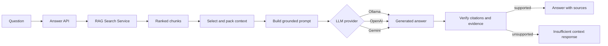

# RAG Answer Service Architecture

## Purpose and boundary

The RAG Answer Service turns ranked search results into grounded natural-language answers. It owns search orchestration for a question, context selection, prompt construction, LLM provider selection, citation and faithfulness checks, model comparison, and Server-Sent Events progress. It does not create embeddings or query the database directly.

The service normally runs on port 8002. Its APIs are mounted below `/rag`, and its development UI is available at `/ui/answer`.

## External interfaces

| Interface | Purpose |
| --- | --- |
| `POST /rag/answer` | Retrieve evidence and produce one grounded answer. |
| `POST /rag/answer/compare` | Reuse one retrieval result and compare several configured models. |
| `POST /rag/answer/compare/stream` | Stream comparison lifecycle and per-model results through Server-Sent Events. |
| `/health` and `/ready` | Report process health and Search Service readiness. |

## Internal components

| Component | Responsibility |
| --- | --- |
| `AnswerService` | Coordinates retrieval, context creation, model generation, verification, comparison, and response assembly. |
| `RagSearchClient` | Calls the Search Service with chunk text and metadata enabled. |
| `ContextBuilder` | Selects, sorts, excerpts, labels, and packs sources within configured character budgets. |
| `PromptBuilder` | Creates the grounded-answer prompt with source labels, citation rules, answer mode, and guardrail instructions. |
| LLM provider factory | Selects Ollama, OpenAI, or Gemini and normalizes the generation interface. |
| `FaithfulnessVerifier` | Confirms that source-rank citations exist, cited chunks match, named query anchors appear in context, unsupported inference language is absent, and answer terms overlap the evidence. |

## Answer data flow

## Control flow

1. The API validates the question, search mode, filters, answer mode, context limits, provider comparison list, and optional diagnostic flags.
2. `RagSearchClient` calls `/rag/search` or `/rag/search/debug` and requests both metadata and chunk text.
3. `ContextBuilder` selects up to the configured number of results, favors passages that contain query terms, applies per-source limits, and labels every block with source rank, title, chunk, page, and section information.
4. If context is required but retrieval returned no usable evidence, the service returns `insufficient_context` without calling an LLM.
5. `PromptBuilder` tells the model to use only supplied evidence and to cite source ranks in the expected format.
6. The selected LLM provider generates a response.
7. `FaithfulnessVerifier` rejects missing or unknown citations, wrong chunk references, unsupported inference phrases, missing named anchors, and low evidence-term overlap.
8. Unsupported output is replaced by a deterministic insufficient-context response instead of being returned as an answer.
9. The response includes answer status, provider and model, retrieval counts, cited source ranks, verification details, and optional source and observability data.

## Model comparison and streaming

Comparison resolves each model specification to an Ollama, OpenAI, or Gemini provider. Retrieval and context building run once, giving every model the same evidence. Non-streaming comparison returns all model results together. Streaming comparison emits `search_complete`, `model_started`, `model_result`, and `complete` events. A failure in one model becomes a failed model result and does not stop the remaining comparisons.

## Grounding and citation controls

The service treats retrieved text as the only evidence source. Citation labels are generated from Search Service metadata, then verified after generation. The verifier is intentionally conservative: an answer that cannot be checked is downgraded to `insufficient_context`. This reduces unsupported answers, but it is a heuristic check rather than a formal proof of factual correctness.

## Dependencies and configuration

The Search Service is mandatory. At least one LLM backend must be available: local Ollama, OpenAI with an API key, or Gemini with an API key. Context size, per-source size, default `top_k`, timeouts, model list, temperature, system instructions, and observability are environment-configurable.

## Failure handling and observability

- Search dependency failures are surfaced as dependency errors.
- Individual comparison-model failures are isolated and reported without cancelling the whole comparison.
- Timeouts are bounded and validated at startup.
- Optional observability includes search, context packing, provider creation, generation, verification, and total timing.
- Trace context is forwarded to the Search Service and included in logs.

## Security and deployment

The Secure API Gateway is the intended public entry point and enforces the `rag_user` or administrative roles. Raw prompts and debug search data can contain document content and should not be enabled for general users. Provider API keys must be supplied through secret management rather than configuration maps.

Kubernetes manifests are under `k8s/rag-answer-service`. The main dependencies are the Search Service and one configured LLM endpoint.

## Key source files

- `app/api/rag_answer_routes.py`
- `app/services/answer_service.py`
- `app/services/search_client.py`
- `app/services/context_builder.py`
- `app/services/prompt_builder.py`
- `app/services/faithfulness_verifier.py`
- `app/services/llm_providers/factory.py`
- `app/core/config.py`

