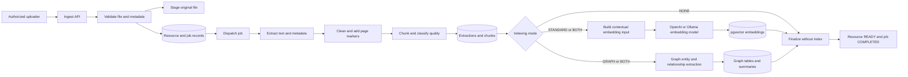

# RAG Ingest Service Architecture

## Purpose and boundary

The RAG Ingest Service converts uploaded documents into persistent, searchable content. It owns upload validation, file staging, metadata normalization, text extraction, cleanup, chunking, chunk-quality classification, vector generation, optional graph indexing, job tracking, recovery, and ingestion diagnostics. It does not answer questions or rank search results.

The service runs as a FastAPI application, normally on port 8000. Its API is mounted below `/rag`, and its development UI is available at `/ui`.

## External interfaces

| Interface | Purpose |
| --- | --- |
| `POST /rag/ingest` | Accept a multipart document and ingestion settings, create a resource and job, and dispatch background processing. |
| `GET /rag/ingest/jobs/{job_id}` | Return job state, progress, counts, and failure information. |
| `GET /rag/ingest/jobs/{job_id}/errors` | Return persisted processing errors for a job. |
| `POST /rag/ingest/resources/{resource_id}/retry` | Create a retry job for a failed or incomplete resource. |
| `POST /rag/ingest/resources/{resource_id}/index` | Build standard embeddings, Graph RAG data, or both from an existing resource. |
| `GET` and `PUT /rag/settings/graph-rag` | Read or change persisted Graph RAG runtime settings. |
| `DELETE /rag/dev/resources/{resource_id}` | Development-only hard deletion of a resource and related data. |
| `/health` and `/ready` | Report process health and dependency readiness. |

## Internal components

| Component | Responsibility |
| --- | --- |
| `IngestService` | Validates the request, stages the file, merges file and request metadata, persists the catalog resource, and creates the ingestion job. |
| `FileStorageService` | Saves uploads and calculates file size and SHA-256 hashes. |
| `FileMetadataService` | Reads metadata from PDF, DOCX, and EPUB files and merges it with request metadata. |
| `TextExtractionService` | Extracts TXT, PDF, DOCX, and EPUB text through format-specific parsers. |
| `PdfTextCleanupService` | Removes repeated headers and footers, page-number lines, boilerplate, excessive whitespace, and selected joined-word artifacts while retaining page markers. |
| `ChunkingService` | Selects semantic-recursive or intelligent-recursive chunking. |
| `chunk_quality` | Cleans chunks, merges undersized neighbors, classifies boilerplate or front matter, and marks unsuitable chunks as non-searchable. |
| `EmbeddingInputService` | Adds resource context, such as title and author, to the text submitted to the embedding model. |
| `EmbeddingService` | Batches embedding calls, retries transient failures with backoff, validates dimensions, and reports profiling events. |
| `GraphIndexingService` | Extracts graph entities and relationships, creates communities, and stores graph summaries. |
| Repository classes | Persist resources, jobs, extractions, chunks, vectors, errors, profiling records, and runtime settings. |
| Worker and dispatchers | Run jobs through FastAPI background tasks, a database worker, RQ, or Kafka, depending on configuration. |

## Ingestion data flow

## Control flow and state transitions

1. The API validates the extension, size, metadata JSON, chunking values, and indexing mode.
2. The service writes the upload to staged storage and calculates a content hash.
3. Catalog metadata and relationships are created or reused, then a `RagIngestionJob` is persisted.
4. A configured dispatcher starts background work. The database record remains the source of truth for job state.
5. The worker marks the job and resource as processing and sends periodic progress and heartbeat updates.
6. The worker reuses an existing extraction or existing chunks when a retry or reindex operation can safely resume.
7. Extracted text is stored before chunking, and chunks are stored before embedding. These checkpoints make retries idempotent at major stages.
8. Standard vectors and Graph RAG data are created according to `indexing_mode`: `NONE`, `STANDARD`, `GRAPH`, or `BOTH`.
9. On success, the service optionally deletes the staged original and marks the resource `READY` and job `COMPLETED`.
10. On failure, the service records the stage, exception details, and failed state. Recovery logic can detect stale processing jobs.

## Text cleanup and chunk preparation

PDF extraction retains page boundaries so later citations can include page ranges. Cleanup detects repeated page lines, standalone page numbers, configured boilerplate phrases, excessive blank lines, and selected word-joining artifacts. Chunking then preserves section titles, heading paths, page ranges, token counts, character counts, chunk types, and extensible metadata.

Chunk-quality rules are loaded from `app/config/chunk_quality_rules.json`. Low-value content can remain persisted for diagnostics while being marked non-searchable, allowing the Search Service to exclude it without losing ingestion history.

## Embedding architecture

The provider factory selects OpenAI or Ollama. The embedding model registry validates supported models and expected dimensions before vectors are written. Embeddings are keyed by chunk, provider, model, and version, allowing the worker to skip vectors that already exist during retries. Each batch is validated for count and dimension before persistence.

The Ingest and Search services must use compatible embedding provider, model, version, and dimension settings. A mismatch prevents meaningful vector similarity and should be treated as a deployment configuration error.

## Persistence model

The service uses PostgreSQL and pgvector. Primary entities include `Resource`, `Author`, `Category`, `Tag`, `RagIngestionJob`, `RagDocumentExtraction`, `RagDocumentChunk`, `RagChunkEmbedding`, `RagProcessingError`, and `RagProfilingEvent`. Graph indexing adds graph entities, relationships, communities, memberships, and summaries.

The resource record connects ingestion state to catalog metadata. Chunks point to both the resource and the job that produced them. Vector records point to chunks. This separation supports job history, resumable processing, and multiple embedding versions.

## Failure handling and observability

- Stage-specific exceptions are recorded in `RagProcessingError` and reflected in job and resource status.
- Heartbeats and stale-job recovery protect against abandoned `PROCESSING` jobs.
- Embedding retries use configurable batch sizes, concurrency, attempt limits, and backoff.
- Profiling events capture parser, chunking, embedding, database, graph, and total-job timings when enabled.
- W3C trace context and request identifiers are accepted and propagated through logs.

## Security and deployment

The intended public path is through the Secure API Gateway, which enforces Keycloak roles and supplies the internal API key and user context. The standalone UI and development deletion endpoint are operational conveniences and should not be publicly exposed.

Kubernetes manifests are under `k8s/rag-ingest-service`. Required dependencies are PostgreSQL with pgvector and, depending on configuration, OpenAI or Ollama plus an optional RQ, Redis, or Kafka backend.

## Key source files

- `app/api/rag_ingest_routes.py`
- `app/services/ingest_service.py`
- `app/workers/rag_ingestion_worker.py`
- `app/services/text_extraction_service.py`
- `app/services/pdf_text_cleanup.py`
- `app/services/chunking_service.py`
- `app/services/chunk_quality.py`
- `app/services/embedding_service.py`
- `app/graph_rag/services/graph_indexing_service.py`
- `app/db/models.py`

