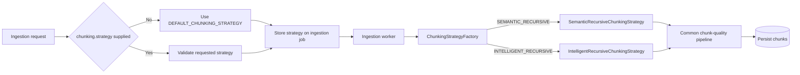

# Chunking Strategy Selection and Behavior

## Summary

The RAG Ingest Service implements two selectable chunking strategies:

- `SEMANTIC_RECURSIVE`
- `INTELLIGENT_RECURSIVE`

Each ingestion job runs exactly one strategy. The strategies are not executed sequentially. `SEMANTIC_RECURSIVE` is the default unless the ingestion request or environment configuration selects `INTELLIGENT_RECURSIVE`.

## Strategy selection flow

1. An ingestion request may set `chunking.strategy` to `SEMANTIC_RECURSIVE` or `INTELLIGENT_RECURSIVE`.
2. If the request does not specify a strategy, the service uses `DEFAULT_CHUNKING_STRATEGY`.
3. The default value of `DEFAULT_CHUNKING_STRATEGY` is `SEMANTIC_RECURSIVE`.
4. The selected strategy is stored in the ingestion-job record.
5. When the worker processes the job, it passes the stored strategy to `ChunkingService`.
6. `ChunkingStrategyFactory` creates one strategy implementation for that job.
7. After the selected strategy creates chunks, the common chunk-quality pipeline processes the result.

## Semantic recursive strategy

Implementation: `app/services/chunking_strategies/semantic_recursive.py`

`SemanticRecursiveChunkingStrategy` is the normal and default strategy. It performs the following operations:

1. Detect sections and headings with the shared `split_sections()` helper.
2. Split each section into paragraphs.
3. Keep complete paragraphs together while building a chunk up to the configured token budget.
4. When adding another paragraph would exceed the budget, flush the current paragraph group and carry the configured overlap into the next group.
5. When one paragraph is larger than the chunk budget, split that paragraph into overlapping fixed windows.
6. Detect supported chapter headings, trailing chapter headings, verse markers, verse ranges, and selected speaker labels.
7. Calculate the chunk hash, token count, character count, section title, heading path, and page range.
8. Record `paragraph_group` or `fallback_token_window` as the chunk type.

This strategy generally preserves semantic paragraph boundaries. Fixed windows are a fallback for oversized paragraphs rather than the normal splitting mechanism.

### Semantic strategy metadata

Depending on the input, its chunk metadata can include:

- Strategy name.
- Split basis.
- Chapter number and title.
- Verse start and end.
- Speaker.
- Section title and heading path.
- Page start and end.

## Intelligent recursive strategy

Implementation: `app/services/chunking_strategies/intelligent_recursive.py`

`IntelligentRecursiveChunkingStrategy` performs the following operations:

1. Detect sections and headings with `split_sections()`.
2. Split each section into whitespace-separated words.
3. Create fixed-size overlapping windows inside the section.
4. Calculate the hash, recorded token count, character count, section title, heading path, and page range.
5. Record `token_window` as the chunk type.

Despite its name, the current implementation is not a deeply recursive separator hierarchy. It is a section-aware, overlapping fixed-window implementation.

The implementation uses `section_text.split()` to construct windows. Therefore, `chunk_size_tokens` controls the number of whitespace-separated words placed in each window, while `count_tokens()` calculates the recorded token count afterward. The configured window size is not enforced through a provider-specific tokenizer in this strategy.

## Shared section detection

The semantic strategy imports `split_sections()` from `intelligent_recursive.py`. This is code reuse, not execution of both chunking algorithms.

When `SEMANTIC_RECURSIVE` is selected:

- `split_sections()` from the intelligent-strategy file runs.
- `IntelligentRecursiveChunkingStrategy.chunk()` does not run.
- Paragraph grouping and semantic fallback behavior come from `SemanticRecursiveChunkingStrategy`.

The shared section detector recognizes:

- Lines beginning with `#`.
- Uppercase lines.
- Short, punctuation-light labels ending in a colon.

It avoids treating a single uppercase letter as a heading by default because PDF drop caps can otherwise separate the first letter from the following word.

## Common chunk-quality processing

Both strategy outputs pass through `filter_quality_chunks()` in `app/services/chunk_quality.py`. This happens in `ChunkingService` after the selected strategy returns its initial chunks.

The common quality stage:

- Cleans chunk text.
- Classifies boilerplate, front matter, tables of contents, and other low-value content.
- Applies the configured minimum alphabetic-character ratio.
- Keeps or excludes numeric-table-heavy chunks according to configuration.
- Marks unsuitable chunks as non-searchable in their metadata.
- Merges compatible undersized neighboring chunks.
- Recalculates chunk indexes and derived values when chunks are merged.

Quality processing is therefore independent of which initial chunking strategy was selected.

## Configuration and persistence

The relevant configuration values are:

| Setting | Default | Purpose |
| --- | --- | --- |
| `DEFAULT_CHUNKING_STRATEGY` | `SEMANTIC_RECURSIVE` | Strategy used when a request does not select one. |
| `DEFAULT_CHUNK_SIZE_TOKENS` | `1200` | Default target chunk budget. |
| `DEFAULT_CHUNK_OVERLAP_TOKENS` | `80` | Default overlap between consecutive chunks or windows. |
| `MINIMUM_CHUNK_TOKENS` | `80` | Threshold used by the quality pipeline when merging small chunks. |
| `CHUNK_QUALITY_KEEP_NUMERIC_TABLE_CHUNKS` | `true` | Controls retention of numeric-table-heavy content. |
| `CHUNK_QUALITY_MIN_ALPHA_RATIO` | `0.45` | Minimum alphabetic-character ratio used by quality filtering. |

The selected strategy is stored in `RagIngestionJob.chunking_strategy`. The worker reads this stored value, which means retries use the job's persisted strategy rather than silently switching to the current environment default.

## Main source files

| File | Relevant responsibility |
| --- | --- |
| `app/schemas/ingest_request.py` | Validates request-level strategy selection. |
| `app/core/config.py` | Defines and validates the default strategy and chunk-quality configuration. |
| `app/services/ingest_service.py` | Resolves the request strategy or default and stores it on the job. |
| `app/db/models.py` | Defines the persisted `chunking_strategy` job field. |
| `app/workers/rag_ingestion_worker.py` | Passes the stored job strategy to `ChunkingService`. |
| `app/services/chunking_service.py` | Builds the selected strategy and applies common quality filtering. |
| `app/services/chunking_strategies/factory.py` | Maps strategy names to their implementations. |
| `app/services/chunking_strategies/semantic_recursive.py` | Implements paragraph-aware semantic chunking and oversized-paragraph fallback windows. |
| `app/services/chunking_strategies/intelligent_recursive.py` | Implements section-aware fixed word windows and shared section detection. |
| `app/services/chunk_quality.py` | Implements cleanup, classification, filtering, and small-chunk merging. |
| `tests/test_chunking_service.py` | Tests both strategy paths and chunk-quality behavior. |

## Tests demonstrating both paths

`tests/test_chunking_service.py` explicitly invokes both strategies:

- `test_intelligent_recursive_chunking_preserves_existing_behavior()` selects `INTELLIGENT_RECURSIVE` and verifies its strategy metadata and detected section title.
- `test_semantic_recursive_groups_paragraphs_before_fixed_windows()` selects `SEMANTIC_RECURSIVE` and verifies paragraph grouping.
- Additional semantic tests verify oversized-paragraph fallback windows, page markers, verse-marker handling, trailing chapter headings, and avoidance of false headings.

These tests confirm that both implementations are active code paths, even though semantic recursive is the default production path.

## Recommended architecture wording

The following wording distinguishes support from per-job execution:

> The service supports two selectable chunking strategies, and each ingestion job uses one strategy. `SEMANTIC_RECURSIVE`, the default, groups paragraphs within detected sections and uses overlapping windows only for oversized paragraphs. `INTELLIGENT_RECURSIVE` uses overlapping fixed-size word windows within detected sections. Both outputs pass through the same chunk-quality pipeline before persistence.

