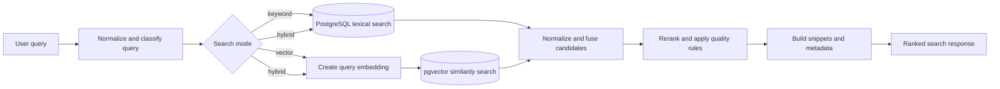

# RAG Search Service Architecture

## Purpose and boundary

The RAG Search Service retrieves and ranks content previously prepared by the RAG Ingest Service. It owns query preprocessing, query embeddings, lexical and vector retrieval, candidate fusion, reranking, result-quality rules, graph retrieval, and resource administration views. It does not extract documents or generate narrative answers.

The service normally runs on port 8001. Search APIs are mounted below `/rag`; administrative APIs are below `/rag/admin`.

## External interfaces

| Interface | Purpose |
| --- | --- |
| `POST /rag/search` | Run vector, keyword, or hybrid search. |
| `POST /rag/search/debug` | Return search results with additional diagnostics when enabled. |
| `POST /rag/graph/search` | Search Graph RAG entities, relationships, and summaries. |
| `POST /rag/search/combined` | Combine standard chunk retrieval with graph retrieval. |
| `GET /rag/admin/resources` | List resources with ingestion, chunk, embedding, and job statistics. |
| `POST /rag/admin/resources/delete` | Delete selected resources through the administrative workflow. |
| `POST /rag/admin/resources/{id}/retry` | Ask the Ingest Service to retry a resource. |
| `POST /rag/admin/resources/{id}/index` | Ask the Ingest Service to build a selected index type. |
| `GET` and `PUT /rag/admin/settings/graph-rag` | Proxy Graph RAG runtime settings to the Ingest Service. |
| `/health` and `/ready` | Report process and database readiness. |

## Internal components

| Component | Responsibility |
| --- | --- |
| `SearchService` | Coordinates request preprocessing, embedding generation, retrieval, ranking, quality checks, and response construction. |
| `QueryPreprocessor` | Normalizes text, expands configured aliases, and identifies broad, summary, exact-quote, or focused query intent. |
| Embedding provider factory | Creates OpenAI or Ollama query embeddings compatible with stored chunk vectors. |
| `RagSearchRepository` | Executes pgvector similarity queries and lexical PostgreSQL queries with resource and metadata filters. |
| `HybridSearchService` | Oversamples vector and keyword candidates and combines them. |
| `RankingService` | Applies score normalization and reciprocal-rank fusion. |
| `RerankingService` | Reorders candidates using configurable relevance heuristics. |
| Result quality and snippet modules | Remove poor candidates, adjust scores, and create focused excerpts. |
| `GraphSearchService` | Retrieves matching graph entities, relationships, and summaries. |
| `AdminResourceService` | Produces operational resource views and forwards retry, delete, index, and settings actions. |

## Search data flow

## Control flow

1. Pydantic validates the query, `top_k`, minimum score, search mode, and filters.
2. Query preprocessing trims and normalizes text, applies aliases, and identifies query intent used by later ranking and snippet selection.
3. The service chooses keyword, vector, or hybrid retrieval. Hybrid search requests more candidates than the final `top_k` so fusion and reranking have enough evidence.
4. Vector search embeds the query with the configured provider and model, then compares it with compatible vectors in pgvector.
5. Keyword search uses PostgreSQL lexical matching against searchable chunks.
6. Hybrid mode normalizes component scores and applies reciprocal-rank fusion. Reranking then adjusts order using query-to-content signals.
7. Quality logic excludes chunks marked non-searchable during ingestion and can suppress boilerplate, front matter, table-of-contents text, or weak results.
8. Snippet logic extracts query-focused text while the response can optionally include the full chunk and metadata.
9. The Answer Service consumes the same endpoint with chunk text enabled to build grounded LLM context.

## Graph and combined retrieval

Graph search queries persisted entities, relationships, communities, and summaries created by the Ingest Service. Combined search runs standard RAG and Graph RAG, then returns both evidence types in one response. Graph search is useful for entity relationships and cross-document structure; standard chunk search remains the main source of verbatim evidence for cited answers.

## Filters and result contract

Search requests can restrict retrieval by resource, category, tags, and metadata. Results include rank, score, resource and chunk identifiers, title, chunk index, page range, section title, snippet, optional chunk text, and optional metadata. Debug mode can include candidate counts, component scores, query intent, ranking decisions, and timing information.

## Embedding compatibility

The Search Service generates a query vector using the same provider, model, version, and dimension expected by the Ingest Service. The embedding model registry validates these settings. Switching models requires reindexing stored chunks or retaining a separately identifiable vector set for the new model.

## Persistence and dependencies

The service reads PostgreSQL and pgvector tables written by the Ingest Service. Administrative actions call the Ingest Service over HTTP instead of directly duplicating its job logic. The Answer Service depends on this service for context retrieval.

## Failure handling and observability

- `/ready` checks required dependencies before declaring the service ready.
- Provider and database errors are normalized into service exceptions and HTTP responses.
- Trace and request identifiers propagate across gateway, search, ingest-admin, and answer calls.
- Optional observability records preprocessing, embedding, retrieval, fusion, reranking, and result-quality timing.
- Debug search should remain disabled or access-controlled outside development environments because it exposes ranking details and more source content.

## Security and deployment

The Secure API Gateway is the intended browser-facing entry point. Search and graph roles are enforced at the gateway, while administrative routes require administrative roles. Internal API-key validation and network isolation should protect direct service access.

Kubernetes manifests are under `k8s/rag-search-service`. Runtime dependencies are PostgreSQL with pgvector, the configured embedding provider, and the Ingest Service for administrative operations.

## Key source files

- `app/api/rag_search_routes.py`
- `app/api/admin_resource_routes.py`
- `app/services/search_service.py`
- `app/services/hybrid_search_service.py`
- `app/services/ranking_service.py`
- `app/services/reranking_service.py`
- `app/search/query_preprocessor.py`
- `app/search/result_quality.py`
- `app/search/snippet_builder.py`
- `app/repositories/rag_search_repository.py`
- `app/services/graph_search_service.py`

