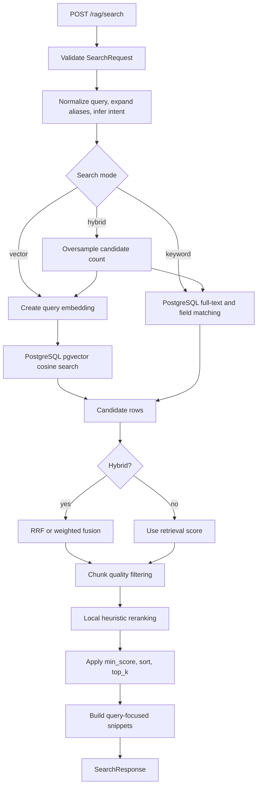
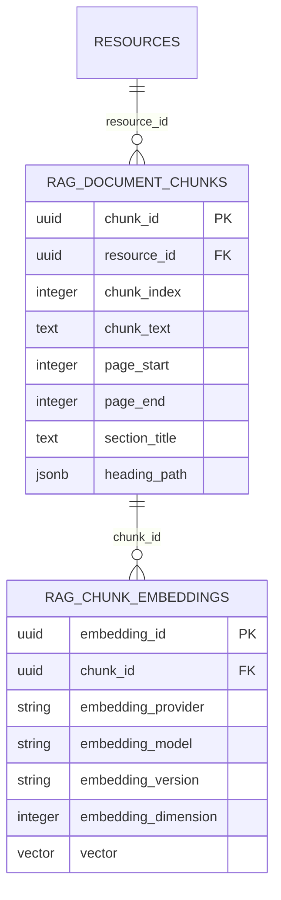

# Search Retrieval, SQL, and Ranking Flow

## Purpose

This document explains the implemented Search Service flow in detail, including vector, keyword, and hybrid retrieval; query preprocessing; PostgreSQL SQL behavior; filtering; fusion; reranking; result-quality controls; and snippet construction. File and line references point to the current source code.

The most important implementation fact is that both semantic and lexical retrieval are performed by PostgreSQL:

- Vector retrieval uses the `pgvector` cosine-distance operator against stored chunk embeddings.
- Keyword retrieval uses PostgreSQL full-text search (`tsvector`/`tsquery`) plus explicit matches against resource fields and tags.
- Hybrid retrieval runs both searches, oversamples their candidate lists, and fuses the candidates in Python.
- The final reranker is currently a local, rule-based scorer. It is not an LLM or cross-encoder reranker.

## Entry points and request contract

The standard endpoint is `POST /rag/search`, defined in `app/api/rag_search_routes.py:14`. It constructs `SearchService` and invokes `SearchService.search(request)` at `app/api/rag_search_routes.py:19`.

The request schema is `app/schemas/search_request.py`:

| Field | Source | Meaning |
|---|---|---|
| `query` | `app/schemas/search_request.py:21` | User query text. |
| `mode` | `app/schemas/search_request.py:22` | `vector`, `keyword`, or `hybrid`; may be omitted to use configuration. |
| `top_k` | `app/schemas/search_request.py:23` | Requested final result count. |
| `min_score` | `app/schemas/search_request.py:24` | Final score threshold. |
| `filters` | `app/schemas/search_request.py:25` | Resource, category, tag, and metadata restrictions. |
| `include_metadata` | `app/schemas/search_request.py:26` | Whether result metadata is returned. |
| `include_chunk_text` | `app/schemas/search_request.py:27` | Whether full chunk text is returned. |

Supported filters are defined at `app/schemas/search_request.py:9-13` and converted into the internal filter object in `app/search/filters.py:7-23`.

## End-to-end control and data flow



The orchestration is implemented by `SearchService._search()` in `app/services/search_service.py:44-116`:

1. Preprocess the query (`:49`).
2. Resolve mode, limits, score threshold, and response flags (`:51-60`).
3. Build database filters (`:63`).
4. Retrieve candidates (`:64`, with mode routing at `:118-200`).
5. Remove low-quality/non-searchable chunks (`:65-81`, decision logic at `:239-254`).
6. Rerank the retained candidates when enabled (`:83-93`).
7. Apply the final threshold, deterministic ordering, and `top_k` (`:95-101`).
8. Build response items and snippets (`:104-116`, `:204-237`).

## 1. Query preprocessing

`QueryPreprocessor.preprocess()` is implemented in `app/search/query_preprocessor.py:36-60`. It:

- collapses repeated whitespace;
- recognizes a quoted exact phrase;
- strips common conversational prefixes and subject prefixes;
- normalizes configured alias spellings;
- tokenizes the normalized query; and
- classifies query intent.

The intent categories are declared at `app/search/query_preprocessor.py:17-22`:

- `exact_quote`
- `title_lookup`
- `summary_request`
- `factual_question`
- `broad_document_query`

Intent inference is at `app/search/query_preprocessor.py:76-94`. It later affects keyword query construction and local reranking. Alias and stop-word definitions, plus the lexical tokenizer, are in `app/search/lexical.py:7-84`.

This preprocessing is not generative query rewriting. It is deterministic normalization, alias replacement, tokenization, and rule-based intent classification.

## 2. Candidate count and hybrid oversampling

Candidate retrieval starts in `SearchService._retrieve()` at `app/services/search_service.py:118`. Normally, the repository limit equals `top_k`. In hybrid mode, it becomes:

```text
retrieve_k = min(search_max_top_k, max(top_k, top_k * hybrid_oversampling_factor))
```

This is implemented at `app/services/search_service.py:130-132`. The default oversampling factor is `5` (`app/core/config.py:36`). For example, a request for 10 final results asks each retriever for as many as 50 candidates, subject to the configured maximum.

Oversampling is important because vector and keyword search often return different chunks. Fusion needs a sufficiently large candidate pool before the final `top_k` truncation.

## 3. Vector search

### Query embedding

For vector or hybrid mode, `SearchService` obtains the configured provider, embeds the normalized query, and calls the repository at `app/services/search_service.py:134-160`.

The provider factory is `app/services/embedding_providers/factory.py:10-23`:

- OpenAI provider: `app/services/embedding_providers/openai_provider.py:10-23`
- Ollama provider: `app/services/embedding_providers/ollama_provider.py:21-41`

The default configuration is Ollama with `nomic-embed-text`; provider, model, version, and dimension settings are declared at `app/core/config.py:22-28`.

No answer-generating LLM is called by this flow. The model call in vector/hybrid search is only for converting the query into an embedding vector.

### Vector SQL

The implemented SQL is constructed in `RagSearchRepository.vector_search()` at `app/repositories/rag_search_repository.py:40-91`. Its essential form is:

```sql
SELECT
    ...,
    1 - (e.vector <=> CAST(:query_vector AS vector)) AS vector_score
FROM rag_chunk_embeddings e
JOIN rag_document_chunks c ON c.chunk_id = e.chunk_id
JOIN rag_resources r ON r.resource_id = c.resource_id
LEFT JOIN rag_categories cat ON cat.category_id = r.category_id
WHERE r.rag_enabled = TRUE
  AND r.ingestion_status = 'READY'
  AND e.provider = :provider
  AND e.model = :model
  AND e.embedding_version = :embedding_version
  AND e.dimension = :dimension
  -- optional resource/category/tag/metadata predicates
ORDER BY e.vector <=> CAST(:query_vector AS vector)
LIMIT :limit
```

The `pgvector` `<=>` operator returns cosine distance. The selected score converts distance to cosine similarity with `1 - distance`. Ordering remains on the raw distance in ascending order, which means the nearest vectors are returned first.

The repository requires an exact provider/model/version/dimension match. This prevents mixing incompatible embedding spaces—for example, comparing a query produced by one model to document vectors produced by another.

### Stored vectors and index

The ORM representation is in `app/db/models.py:205-224`. The canonical database schema is maintained by the ingest module in `modules/rag-ingest-service/sql/schema.sql`:

- `vector` extension: `modules/rag-ingest-service/sql/schema.sql:5`
- embedding table and `vector(768)` column: `:317-329`
- model lookup index: `:455`
- HNSW cosine index: `:477`

The HNSW index can support the current query because the SQL uses a distance operator directly in ascending `ORDER BY` with a `LIMIT`, which is the form required by pgvector for index-backed nearest-neighbor search.

Important dimension constraint: the schema currently declares `vector(768)`, while application configuration exposes an embedding dimension. Changing to a model that does not produce 768-dimensional vectors requires an intentional schema/index migration; changing only environment configuration is insufficient.

### How a semantic vector match resolves back to the chunk text

A vector embedding is not decoded back into text. The system retains the original chunk as a normal database row and stores the embedding in a second row that contains the same `chunk_id`. Semantic search finds the embedding row, then follows that identifier back to the chunk row with a SQL join.

The persistent relationship is:



#### At ingestion time

1. Chunking creates a `rag_document_chunks` row. Its `chunk_id` is the durable identifier and `chunk_text` remains the readable source text. The table definition is at `modules/rag-ingest-service/sql/schema.sql:294-315`; specifically, `chunk_id` is at `:295` and `chunk_text` at `:299`.
2. Before embedding, `EmbeddingInputService.build()` constructs retrieval-oriented input from resource title/author/category/tags/description, section, heading path, page information, and cleaned chunk text (`modules/rag-ingest-service/app/services/embedding_input_service.py:11-57`). This enriched string is what is embedded; it does **not** overwrite the stored `chunk_text` (`:12`, `:24-26`).
3. The ingestion worker builds one embedding input per pending chunk and calls the embedding service at `modules/rag-ingest-service/app/workers/rag_ingestion_worker.py:347-367`.
4. The returned vectors remain positionally paired with their chunks. The worker zips `batch_chunks` and `vectors`, then stores `chunk.chunk_id` beside each vector at `modules/rag-ingest-service/app/workers/rag_ingestion_worker.py:383-395`.
5. `RagEmbeddingRepository.create_embeddings()` persists those rows (`modules/rag-ingest-service/app/repositories/rag_embedding_repository.py:11-15`).
6. The database enforces the link with the foreign key `rag_chunk_embeddings.chunk_id -> rag_document_chunks.chunk_id` at `modules/rag-ingest-service/sql/schema.sql:327`. The unique constraint at `:328` permits separate versions/models for a chunk while preventing a duplicate of the same chunk/provider/model/version combination.

Conceptually, the stored rows look like this:

```text
rag_document_chunks
  chunk_id = C-123
  chunk_text = "The warranty remains valid for two years ..."
  resource_id = R-10
  page_start = 8

rag_chunk_embeddings
  embedding_id = E-456
  chunk_id = C-123       <-- durable link to the readable chunk
  model = "nomic-embed-text"
  vector = [0.018, -0.227, ...]
```

#### At search time

1. The normalized query is embedded with the compatible provider/model (`app/services/search_service.py:134-148`). For example, “How long is product coverage?” becomes a vector in the same embedding space as the stored chunks.
2. PostgreSQL compares the query vector against `rag_chunk_embeddings.vector` and orders embedding rows by cosine distance (`app/repositories/rag_search_repository.py:75`, `:87-88`). The closest vector may be the one with `chunk_id = C-123`, even when the query and chunk do not share the same words.
3. In the **same SQL statement**, the matching embedding is joined to the readable chunk:

   ```sql
   FROM public.rag_chunk_embeddings e
   JOIN public.rag_document_chunks c ON c.chunk_id = e.chunk_id
   JOIN public.resources r ON r.resource_id = c.resource_id
   ```

   This exact join is at `app/repositories/rag_search_repository.py:76-78`.
4. Because of that join, the result row already contains `c.chunk_id`, `c.chunk_text`, chunk index, page range, section, heading path, resource title, and metadata (`app/repositories/rag_search_repository.py:63-75`). There is no second vector-to-text conversion.
5. `SearchService` copies `vector_score` into the candidate score at `app/services/search_service.py:150-151`, then applies quality filtering, optional hybrid fusion, reranking, and final ranking.
6. Response mapping returns the joined `chunk_id`, builds the snippet from the joined `chunk_text`, and optionally returns the complete chunk text at `app/services/search_service.py:219-235`.

The complete semantic lookup chain is therefore:

```text
user query
  -> query embedding
  -> nearest rag_chunk_embeddings.vector
  -> matched embedding row's chunk_id
  -> JOIN rag_document_chunks ON chunk_id
  -> original chunk_text + location/section metadata
  -> snippet/full text in SearchResponse
```

This design also explains why referential integrity matters. If an embedding were stored without the correct `chunk_id`, semantic similarity could identify the vector but the service could not reliably report the source text. The foreign key prevents an embedding from referring to a nonexistent chunk, while the ingestion worker’s chunk/vector count and dimension checks (`modules/rag-ingest-service/app/services/embedding_service.py:137-145` and `modules/rag-ingest-service/app/workers/rag_ingestion_worker.py:368-371`) protect the positional pairing before persistence.

## 4. Keyword search

Keyword retrieval is implemented in `RagSearchRepository.keyword_search()` at `app/repositories/rag_search_repository.py:93-175`.

### Full-text query construction

The SQL begins with a `search_query` CTE:

```sql
WITH search_query AS (
    SELECT
        CASE
            WHEN :exact_quote THEN phraseto_tsquery('english', :query)
            ELSE websearch_to_tsquery('english', :query)
        END AS tsq
)
```

- `phraseto_tsquery` is used for an inferred exact quotation and preserves phrase adjacency semantics.
- `websearch_to_tsquery` is used for ordinary input. It accepts user-oriented search syntax and does not raise syntax errors for typical raw search text.

### Search vector

Each document chunk has a generated `search_vector`:

```sql
search_vector tsvector GENERATED ALWAYS AS (
    to_tsvector('english', coalesce(chunk_text, ''))
) STORED
```

This is defined in `modules/rag-ingest-service/sql/schema.sql:309` and represented in `app/db/models.py:197`. A GIN index is defined at `modules/rag-ingest-service/sql/schema.sql:452`. PostgreSQL can use that index for the full-text match `c.search_vector @@ sq.tsq`.

### Keyword ranking and explicit field boosts

The base lexical score is:

```sql
ts_rank_cd(c.search_vector, sq.tsq)
```

`ts_rank_cd` is PostgreSQL cover-density ranking. The repository then adds explicit application boosts (`app/repositories/rag_search_repository.py:123-143`):

| Match | Added score |
|---|---:|
| Resource title exactly equals query | `+10` |
| Resource title contains query | `+5` |
| Author contains query | `+3` |
| Category name contains query | `+2` |
| A tag contains query | `+2` |
| Raw chunk text contains query | `+1` |

The query matches a row when any of these conditions holds (`app/repositories/rag_search_repository.py:146-159`):

- the chunk `search_vector` matches the `tsquery`;
- for exact quotes, the raw lower-cased chunk contains the phrase;
- title, author, category, or a tag contains the lower-cased query.

The query separately computes `resource_match_score`: exact title match is `2`, title substring match is `1`, otherwise `0` (`app/repositories/rag_search_repository.py:119-122`). This value helps ordering and later reranking.

Keyword results are ordered first by resource-title relevance. For a title match, earlier chunks are favored; then keyword score and resource creation time are used (`app/repositories/rag_search_repository.py:163-171`).

## 5. SQL filters

Dynamic predicates are assembled in `RagSearchRepository._build_filter_clauses()` at `app/repositories/rag_search_repository.py:177-202`:

```sql
-- one resource
r.resource_id = CAST(:resource_id AS uuid)

-- category
cat.name = :category

-- any requested tag
EXISTS (
    SELECT 1
    FROM rag_resource_tags rt
    JOIN rag_tags t ON t.tag_id = rt.tag_id
    WHERE rt.resource_id = r.resource_id
      AND t.name = ANY(:tags)
)

-- JSON object containment
r.metadata_json @> CAST(:metadata_json AS jsonb)
```

The metadata expression uses JSONB containment: every key/value structure supplied by the filter must be contained in `metadata_json`. The schema provides a GIN index for resource metadata at `modules/rag-ingest-service/sql/schema.sql:437`.

Tag semantics are currently **match any supplied tag**, not match all tags, because the predicate uses `t.name = ANY(:tags)` inside one `EXISTS` clause.

## 6. Hybrid fusion

After both repositories return, `HybridSearchService.merge()` selects reciprocal-rank fusion (RRF) or weighted-score fusion at `app/services/hybrid_search_service.py:5-16`. The default is RRF (`app/core/config.py:37`).

### Reciprocal-rank fusion

RRF is implemented at `app/services/hybrid_search_service.py:18-51`. Candidates are merged by `chunk_id`; each retriever contributes according to rank rather than raw score:

```text
hybrid_score =
    vector_weight  / (rrf_k + vector_rank)
  + keyword_weight / (rrf_k + keyword_rank)
```

The defaults are:

- vector weight: `0.70`
- keyword weight: `0.30`
- `rrf_k`: `60`

These are defined at `app/core/config.py:34-38`.

Rank-based fusion is useful here because cosine similarity and `ts_rank_cd` plus boosts are not naturally calibrated to the same numeric scale.

### Weighted-score fusion

The alternative implemented fusion strategy is at `app/services/hybrid_search_service.py:53-89`. It min-max normalizes the vector and keyword scores separately using `app/search/score_normalizer.py`, then combines them:

```text
hybrid_score = vector_weight * normalized_vector_score
             + keyword_weight * normalized_keyword_score
```

It can also add a small resource-title match boost.

Weighted fusion preserves score magnitude, but its behavior depends more heavily on score distributions in each candidate batch. RRF is generally less sensitive to one retriever producing numerically larger scores.

Implementation observation: hybrid fusion and the reranker support an `exact_phrase_match` candidate flag, but the current repository queries do not explicitly select/populate that field. Exact-phrase behavior is still provided by `phraseto_tsquery`, raw substring matching, intent-aware reranking, and keyword scoring, but the extra fusion-time flag bonus is not normally activated by the repository result as currently written.

## 7. Quality controls

Candidate filtering is applied before reranking in `app/services/search_service.py:65-81`. The decision path is in `SearchService._keep_candidate()` at `:239-254` and uses `app/search/result_quality.py`.

The checks include:

- reject empty text;
- require at least five meaningful tokens;
- reject short boilerplate/front-matter strings;
- reject unusually low alphabetic content unless numeric tables are configured to be retained;
- reject mojibake/corrupted text;
- honor chunk metadata such as `searchable: false` or quality status `filtered`;
- strip page-marker text before returning content.

Core text checks are at `app/search/result_quality.py:22-46`, metadata checks at `:49-52`, page-marker removal at `:55-57`, and boilerplate detection at `:60-72`.

The service deliberately allows some otherwise-low-value candidates to survive if metadata explicitly permits them, the result is not boilerplate, or a strong resource/title match exists. That precedence is visible at `app/services/search_service.py:239-254`.

## 8. Local reranking

When enabled, candidates are truncated to `search_rerank_top_n` and passed to `RerankingService.rerank()` (`app/services/search_service.py:83-93`). Defaults are enabled, local strategy, and top 30 candidates (`app/core/config.py:39-41`).

The reranker is implemented in `app/services/reranking_service.py:10-113`. Its heuristic signals include:

- exact phrase occurrence;
- query-token coverage in chunk text;
- query-token coverage in the resource title;
- a bonus when all query terms appear;
- resource/title match score;
- early-chunk preference for title lookups;
- exact-quote success or failure;
- summary/broad-query preference and front-matter penalties;
- a small capped contribution from the original retrieval score.

This is inexpensive and deterministic, but it is not semantic pairwise relevance scoring. The `_direct_evidence_score()` logic at `app/services/reranking_service.py:86-97` also contains domain-specific vocabulary, so it should be generalized or made configurable if the corpus expands beyond the current subject area.

## 9. Final ranking and response construction

`RankingService.apply()` in `app/services/ranking_service.py:1-12`:

1. removes candidates below `min_score`;
2. sorts by exact-phrase status, score, resource match, and chunk order; and
3. keeps the requested final result count.

`SearchService._to_result()` maps candidates to the response at `app/services/search_service.py:204-237`. The response fields are declared in `app/schemas/search_response.py:6-36` and include:

- rank and score;
- resource and chunk identifiers;
- resource title;
- page start/end;
- section and heading path;
- snippet;
- optional full chunk text and metadata.

Snippets are built by `app/search/snippet_builder.py:5-22`. For long text, it finds the first direct query-term occurrence, starts the excerpt roughly one-third of the snippet length before it, limits the result to 320 characters, and adds ellipses when text was omitted.

One limitation is that snippet matching uses a simple `query.split()` search. It does not reuse the alias-normalized lexical tokens or PostgreSQL headline generation, so highlighting/excerpt selection may differ from the database match logic.

## Mode-by-mode summary

| Mode | Query embedding | PostgreSQL retrieval | Fusion | Typical strength |
|---|---|---|---|---|
| `vector` | Yes | pgvector cosine distance | No | Semantic similarity and paraphrases. |
| `keyword` | No | Full-text search plus field/tag substring matches | No | Exact terms, names, titles, quotations. |
| `hybrid` | Yes | Both of the above | RRF by default; weighted is available | Balances semantic and lexical evidence. |

The tests that establish these behaviors are in `modules/rag-search-service/tests/test_rag_search.py`, including keyword search without embedding (`:175`), vector embedding (`:197`), hybrid merge (`:216`), oversampling (`:236`), RRF (`:267`), query normalization (`:288`), exact quotes (`:440`), title matching (`:480`), reranking (`:531`), low-value filtering (`:731`), metadata searchability (`:782`), numeric tables (`:824`), and page-marker cleanup (`:864`).

## Current defaults

Search settings are defined in `app/core/config.py:22-47`:

| Setting | Default |
|---|---:|
| Mode | `hybrid` |
| Final `top_k` | `10` |
| Maximum `top_k` | `50` |
| Minimum score | `0.0` |
| Vector weight | `0.70` |
| Keyword weight | `0.30` |
| Hybrid oversampling | `5` |
| Fusion | `rrf` |
| RRF K | `60` |
| Reranking | enabled |
| Rerank top N | `30` |
| Reranker | `local` |
| Numeric-table retention | enabled |

## SQL/index behavior and operational cautions

### Exact versus approximate vector retrieval

Without an approximate index, pgvector performs exact nearest-neighbor search. This gives perfect search recall relative to the selected distance but is slower as the corpus grows. The schema installs an HNSW cosine index, allowing PostgreSQL to choose approximate index search for suitable queries.

HNSW commonly offers a stronger speed/recall tradeoff than IVFFlat but uses more memory and has slower index construction. IVFFlat is an alternative when build speed and index size matter and the dataset is sufficiently populated before index creation.

### Filters and approximate indexes

With approximate vector indexes, filtering can reduce the number of qualifying rows after the index scan. The application’s hybrid oversampling enlarges the requested SQL result limit, but it cannot fully recover candidates PostgreSQL never returned because of approximate-index filtering. For heavily filtered workloads, consider:

- pgvector iterative index scans;
- a partial vector index for common fixed predicates;
- partitioning by a high-selectivity tenant/category field; or
- increasing HNSW search breadth after measurement.

### Full-text versus substring search

PostgreSQL full-text search handles stemming, lexeme normalization, ranking, and indexed matching. The current extra `ILIKE '%query%'` resource-field predicates improve title/author/category/tag discovery but may not use a normal B-tree index. The schema enables `pg_trgm` and defines a trigram GIN index for `chunk_text` (`modules/rag-ingest-service/sql/schema.sql:451`), although the keyword query’s broad raw substring checks should still be inspected with `EXPLAIN (ANALYZE, BUFFERS)` on realistic data.

## Alternatives and when to consider them

| Area | Current implementation | Alternative | When useful |
|---|---|---|---|
| Vector retrieval | pgvector HNSW/cosine | Exact scan | Small corpora or when maximum recall matters more than latency. |
| Vector index | HNSW | IVFFlat | Lower index-build cost/memory, with careful list/probe tuning. |
| Lexical retrieval | PostgreSQL FTS with `ts_rank_cd` | Custom weighted `tsvector` using `setweight` | When title, heading, and body lexemes should have structured field weights rather than additive SQL bonuses. |
| Typo/fuzzy matching | Some substring checks; `pg_trgm` installed | Explicit trigram similarity/operator queries | Misspellings, near-title matching, or languages where exact substring logic is too strict. |
| Hybrid fusion | RRF or normalized weighted sum | Learned fusion/ranking | Enough relevance judgments and traffic exist to train and evaluate coefficients. |
| Reranking | Local heuristics | Cross-encoder/reranker model | Higher relevance quality justifies added latency and inference cost. |
| Search platform | PostgreSQL | OpenSearch/Elasticsearch or a vector database | Operational scale or specialized search features exceed the desired PostgreSQL footprint. This adds synchronization and consistency work. |
| Snippets | Character-window excerpt | PostgreSQL `ts_headline` or token-aware highlighter | Better term highlighting and excerpts aligned with FTS parsing. |

These are alternatives, not descriptions of code currently running.

## Recommended verification queries

Use PostgreSQL execution plans against production-like row counts and filter distributions:

```sql
EXPLAIN (ANALYZE, BUFFERS)
SELECT e.chunk_id
FROM rag_chunk_embeddings e
JOIN rag_document_chunks c ON c.chunk_id = e.chunk_id
JOIN rag_resources r ON r.resource_id = c.resource_id
WHERE r.rag_enabled = TRUE
  AND r.ingestion_status = 'READY'
ORDER BY e.vector <=> CAST(:query_vector AS vector)
LIMIT 50;
```

```sql
EXPLAIN (ANALYZE, BUFFERS)
SELECT c.chunk_id, ts_rank_cd(c.search_vector, q.tsq)
FROM rag_document_chunks c
CROSS JOIN (
    SELECT websearch_to_tsquery('english', :query) AS tsq
) q
WHERE c.search_vector @@ q.tsq
ORDER BY ts_rank_cd(c.search_vector, q.tsq) DESC
LIMIT 50;
```

Check whether the vector plan uses the HNSW index and the text plan uses the GIN index. Repeat with representative resource/category/tag/JSONB filters because filtered plans and result counts can differ substantially from unfiltered ones.

## Useful primary references

- [pgvector: distance operators, HNSW, IVFFlat, filtering, iterative scans, and hybrid search](https://github.com/pgvector/pgvector)
- [PostgreSQL text-search controls: `websearch_to_tsquery`, `phraseto_tsquery`, ranking, and highlighting](https://www.postgresql.org/docs/current/textsearch-controls.html)
- [PostgreSQL preferred full-text indexes](https://www.postgresql.org/docs/current/textsearch-indexes.html)
- [PostgreSQL GIN indexes](https://www.postgresql.org/docs/current/gin.html)
- [PostgreSQL JSONB containment and indexing](https://www.postgresql.org/docs/current/datatype-json.html)
- [PostgreSQL `pg_trgm` similarity and index support](https://www.postgresql.org/docs/current/pgtrgm.html)
- [PostgreSQL execution-plan inspection](https://www.postgresql.org/docs/current/using-explain.html)
- [OpenAI embeddings guide](https://platform.openai.com/docs/guides/embeddings)
- [Ollama embedding API](https://docs.ollama.com/api/embed)

## Key takeaways

1. The service really implements all three modes: vector, keyword, and hybrid.
2. PostgreSQL is the retrieval engine for both vectors and text; hybrid fusion and reranking occur in application code.
3. Hybrid search oversamples both candidate sets before RRF or weighted fusion and before final `top_k` selection.
4. Vector compatibility is enforced by provider, model, version, and dimension, but the schema’s fixed `vector(768)` still requires migration when changing dimensions.
5. The current reranker is deterministic heuristics, not an LLM/cross-encoder.
6. Result quality controls explicitly remove non-searchable metadata and common low-value text before final ranking.
7. The most important next validation is measuring real execution plans, filtered recall, latency, and ranking quality with a representative relevance test set.
