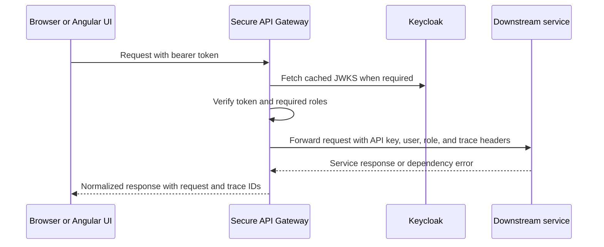

# Secure API Gateway Architecture

## Purpose and boundary

The Secure API module is the browser-facing security and routing boundary. It authenticates users with Keycloak, validates JWTs, extracts roles, applies endpoint authorization, forwards requests to internal services, adds trusted internal headers, and returns consistent error responses. It also serves the legacy unified HTML interface.

The gateway normally runs on port 8010. Clients should reach downstream services through this gateway rather than calling them directly.

## External interfaces

| Route group | Main responsibility |
| --- | --- |
| `/auth` | Registration options, user registration, login, refresh, logout, and current-user details. |
| `/rag` | Ingest, standard and graph search, answers, comparison streaming, resource administration, job monitoring, and Graph RAG settings. |
| `/library/catalog` | Catalog list, detail, facets, and health proxying. |
| `/library-search` | Natural-language structured library questions. |
| `/library-tools` | MCP tool discovery and controlled tool calls. |
| `/health` | Gateway liveness and optional downstream status. |
| `/ui` | Legacy browser application. |

## Internal components

| Component | Responsibility |
| --- | --- |
| Keycloak client | Performs password-grant login, registration administration, refresh, and logout operations. |
| JWT validator | Downloads and caches Keycloak JWKS data, verifies signatures and claims, and creates the current-user principal. |
| Role dependencies | Enforce endpoint-specific roles such as `rag_user`, `rag_search_user`, `rag_ingest_user`, `graph_rag_user`, `rag_admin`, and `system_admin`. |
| `DownstreamClient` | Sends JSON, multipart, and streaming requests to internal services with timeouts and standardized errors. |
| Catalog, library-search, and MCP clients | Adapt gateway routes to specialized downstream interfaces. |
| Request-context middleware | Creates or accepts trace and request identifiers and returns them in response headers. |
| Exception handlers | Normalize authentication, authorization, validation, dependency, and unexpected failures. |

## Request control flow

## Authentication and authorization

Keycloak issues access and refresh tokens. The gateway verifies access-token signatures, issuer, audience or authorized party settings, expiry, and other configured claims. It combines realm roles with roles assigned to the configured Keycloak client. FastAPI dependencies enforce the minimum role set for each route.

UI route guards improve navigation but do not replace gateway enforcement. Administrative operations require `rag_admin` or `system_admin`; ingest, search, graph, and answer routes have separate role sets.

## Downstream routing

| Gateway capability | Downstream target |
| --- | --- |
| Ingest and job status | RAG Ingest Service on port 8000 |
| Search and resource administration | RAG Search Service on port 8001 |
| Answer and model comparison | RAG Answer Service on port 8002 |
| Catalog | Online Library API on port 8003 |
| MCP tools | Online Library MCP on port 8004 |
| Natural-language library search | Online Library Agent on port 8005 |

The gateway forwards `X-API-Key`, user identity, user roles, request IDs, `traceparent`, trace IDs, and span IDs. This lets downstream services trust gateway-authenticated context while preserving an end-to-end trace.

## Streaming behavior

The model-comparison endpoint forwards Server-Sent Events without buffering the complete response. The gateway retains authentication and authorization at stream creation, propagates headers to the Answer Service, and passes events to the browser as they arrive.

## Failure handling and observability

- Authentication failures return `401`; role failures return `403`.
- Downstream timeouts, connection failures, and non-success responses are converted to consistent gateway errors while retaining safe details.
- Every request receives a request ID and trace context, which are added to structured logs and response headers.
- `/health/details` and `/rag/test-downstream` support operational checks but should be access-controlled in non-development deployments.

## Security considerations

- The gateway is the policy enforcement point; downstream service ports should be private.
- Internal API keys and Keycloak client secrets belong in Kubernetes Secrets or an equivalent secret manager.
- CORS origins must be restricted to deployed UI origins.
- The legacy UI stores tokens in browser `localStorage`; the Angular client also manages refresh behavior. Production deployment should evaluate safer browser-session storage and CSRF implications.
- Forwarded user headers are trustworthy only when downstream access is limited to the gateway.

## Deployment

Kubernetes manifests are under `k8s/secure-api`. Configuration includes Keycloak realm and client values, allowed origins, downstream base URLs, timeouts, internal API credentials, and database settings used by registration support.

## Key source files

- `app/main.py`
- `app/auth/jwt_validator.py`
- `app/auth/dependencies.py`
- `app/auth/roles.py`
- `app/auth/keycloak_client.py`
- `app/routes/rag_gateway_routes.py`
- `app/routes/library_catalog_routes.py`
- `app/routes/library_search_routes.py`
- `app/routes/library_tools_routes.py`
- `app/services/downstream_client.py`
- `app/middleware/request_context.py`

