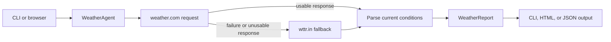

# Weather Agent Architecture

## Purpose and boundary

The Weather Agent is a small tool-backed demonstration that retrieves current weather for a location and exposes the result through a CLI, HTML form, and JSON API. Despite its name, the current module constructs a CrewAI agent object but its public `current_weather` operation returns the deterministic weather-tool result without asking an LLM to rewrite it.

## Interfaces

| Interface | Purpose |
| --- | --- |
| CLI | Accept location arguments and print current conditions. |
| `GET /` | Render the HTML location form. |
| `POST /weather` | Submit the form and render a weather report. |
| `GET /api/weather` | Return a structured JSON weather report. |
| `GET /health` | Report process health. |

## Data flow

## Components and behavior

`Location` normalizes city, state or region, and country and builds provider-specific paths. `get_weather_report` tries weather.com first and then wttr.in. Parser helpers normalize temperature, feels-like temperature, humidity, wind, condition text, and source URL into `WeatherReport`. The API and CLI adapt that same domain result to their output format.

## Failure handling and security

Network failures and unparseable provider responses cause fallback or a user-visible error. User-provided location values are URL-encoded by the HTTP client path construction and HTML output is escaped. The service depends on public weather websites and their response formats, so it is a demonstration rather than a stable production weather integration.

## Key source files

- `agent.py`
- `weather_service.py`
- `api.py`
- `cli.py`

