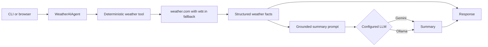

# Weather AI Agent Architecture

## Purpose and boundary

The Weather AI Agent demonstrates grounded LLM summarization of current weather observations. It retrieves structured weather through the deterministic weather module and then asks a configured CrewAI-backed Gemini or Ollama model to summarize only those facts. It exposes a CLI, HTML form, and JSON API.

## Interfaces

| Interface | Purpose |
| --- | --- |
| CLI | Accept a location and print an AI-written weather summary with source observations. |
| `GET /` | Render the HTML location form. |
| `POST /weather` | Generate and render a grounded summary. |
| `GET /api/weather` | Return the request, raw weather facts, summary, provider, and model as JSON. |
| `GET /health` | Report process health. |

## Data and control flow

## Components and behavior

`WeatherAIAgent` loads provider configuration, constructs the CrewAI LLM and agent, invokes `fetch_current_weather`, and supplies a compact factual observation string to the summarization task. `weather_tool.py` adapts the deterministic `weather_agent` service. Response models keep the source weather report alongside the generated summary so callers can inspect the grounding data.

## Configuration and dependencies

The provider can be Gemini or Ollama. Gemini requires an API key and normalized model name; Ollama requires a reachable local model endpoint. The module also depends on the deterministic weather module and external weather websites.

## Failure handling and security

- Weather retrieval fails before model generation when no provider returns usable observations.
- Missing provider credentials or invalid provider names fail configuration early.
- The prompt instructs the model to use only supplied observations, but the summary remains generated text and should be displayed with the raw facts and source.
- API keys belong in environment secrets and must not be written to responses or logs.
- HTML output escapes location and generated content.

## Key source files

- `agent.py`
- `weather_tool.py`
- `config.py`
- `models.py`
- `api.py`
- `cli.py`

